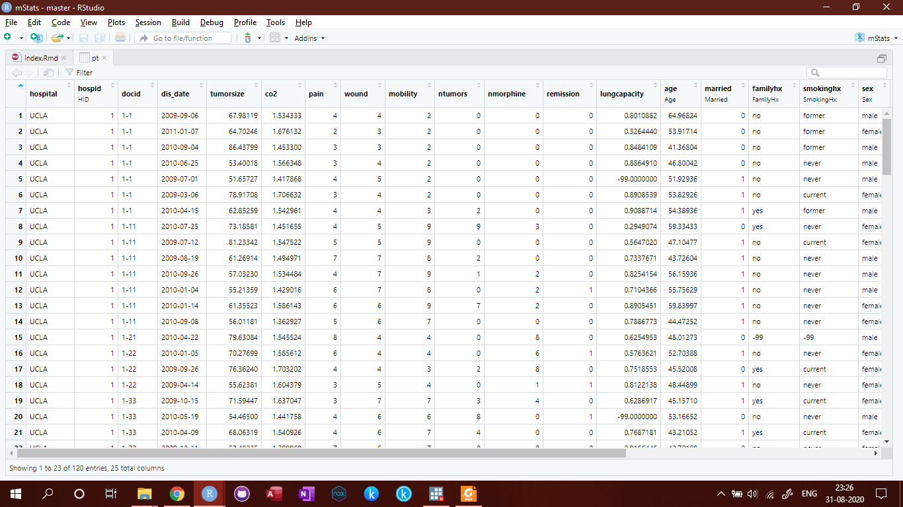
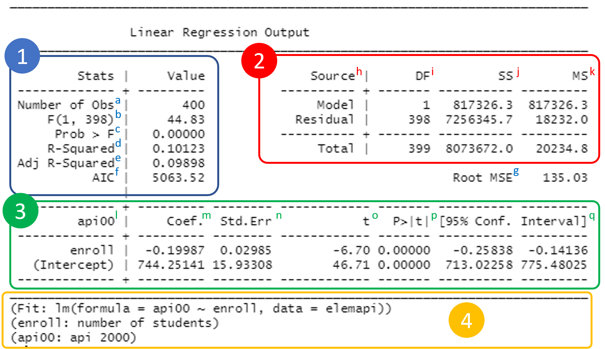

```{r setup, include=FALSE}
knitr::opts_chunk$set(
  collapse = TRUE,
  comment = "#>",
  fig.path = "man/figures/README-",
  out.width = "100%"
)
options(tibble.print_min = 5, tibble.print_max = 5)

## load packages
library(magrittr)
library(mStats)
```
 
 
# Introduction   
*** 
This chapter introduces you to R, RStudio, packages and other things to get you started in R. 

## R

`R` is a **free** software for statistics and graphics. It is widely used among statisticians and data scientists for developing statistical software and data analysis. It is also increasingly popular among medical and public health researchers and analysts. `R` is primarily developed in three programming languages: C, Fortran, and R itself. Although It can be used by its default command-line interface, there are several third-party integrated development environments (IDE) with a friendly graphical user interface, including RStudio and Jupyter Notebook.    

`R` comes from `S programming language`. `S` was created by [John Chambers](https://en.wikipedia.org/wiki/John_Chambers_(programmer)) in 1976 at Bell Labs. Later two statisticians, Ross Ihaka and Robert Gentleman developed R that is currently developed by the R Development Core Team. `R` is named partly after them and partly as a play on the name of `S`.    


R has a steep learning curve, especially for people working in the health sector, including medical doctors and public health professionals. They just want to get on with data analysis, rather than spending months or even years to master the basics of programming aspects of R. Although these may be the core advantages of R that may come into use later, it seems a very daunting process to them. With that in mind, the `mStats` package is developed to speed up the process of learning data analysis in R without the need of detailed knowledge of the basics of R. There are several such well-known packages for epidemiological calculations such as `epicalc`, `epiR`, `epitools` and `epistats`. There are advantages of using the `mStats`. First, all functions are developed from the user perspectives to be easy to recall their names. Second, they only perform a task with fewer options than a conventional function in R. This simplifies the thinking and implementation process. Third, the first input into the function is `data`. This has two benefits. It saves the nuisance of writing subsetting commands and these functions can handle the pipe operation using the function, `%>%` of the package `magrittr`.

R can be downloaded from [http://cran.r-project.org/](http://cran.r-project.org/). 


## RStudio  
***

`RStudio` is an integrated development environment for R. It meansIt comes in two versions: Desktop version is a desktop application and server version runs on a web browser. Regular `RStudio` for personal usage is free for both desktop and server version.    

> If R is a car engine, then RStudio is every other thing that makes driving car fun.

`RStudio` can be downloaded from [https://rstudio.com/products/rstudio/download](https://rstudio.com/products/rstudio/download). 

### RStudio's Interface
***

The interface has four windows. Each window may have several tabs or sub-windows. By default, Source is on the top-left corner, console on bottom-left, environment on top-right, and files on bottom-right. 

1. `Source` is a text editor that will be referred to as R Script later on. You can write commands and save them, which is the main point of reproducibility. Anyone who has this R Script can review and edit it in the future. 
2. `Console` is the place you write your line-by-line command. It means you can only write a single command or a long paragraph of commands. After you close the RStudio, the commands will not be saved unless you specified to do so. However, it is the best way to saving R Script to store the commands you desire. 
    -	Symbol “>” called prompt
    -	Type `3 + 4`, and press `Enter`. 
3. `Environment` has several sub-windows. For data management and beginner, you only have to know `Environment` and `History`. 
    - `Environment` is where R works. 
    - `Global Environment` is the place where your data will be after importing data.
    - `History` saves the commands you run in R console.
    - `Connections` is where you connect to external databases.
4. `Files` also has several sub-windows. 
    - `Files` is like a folder manager on your phone. You can manage files and folders as well as set the working directory.
    - `Plots` is where your plots will appear.
    - `Packages` is where you manage your R packages. You can install it from CRAN or other repositories. You can also install locally stored R packages.
    - `Help` is where R stores documentations. You can open the help or introduction page of the respective packages as well as individual functions. 
    

 
## mStats 
***

<!-- badges: start -->

[](https://cran.r-project.org/package=mStats)
[](https://cran.r-project.org/package=mStats)

<!-- badges: end -->

<a href='https://myominnoo.github.io'></a>
 
The `mStats` is a R package that provides tools for epidemiological and statistical data analysis. There are four major groups of functions: 

  - `data management` - cleans, processes and manages your
    dataset.
  - `statistical analysis` - produces well-formatted outputs of
    common statistical procedures.
  - `epidemiological calculation` - integrates such calculations into
    your pipeline of analysis.
  - `helpers` - support the remaining functions in their calculation and output as well as streamline the process of transferring results for manuscript writing. 

### History
***

The package `mStats` came into life when I started my Ph.D. in 2018. Its first version was released on GitHub in late 2018. Initially, it was intended for fun and I wanted to know how much I could make use of what I have learned R so far. Also, I would like to create something different which may not be entirely innovative since there are lots of good R packages out there.

Two main packages deeply inspired me, `tidyverse` and `epicalc`. In the first version of `mStats`, I created some functions to make plots based on `ggplot2`. I updated several small patch versions adding a few more functions that were interesting to me at that time. In mid-2019, I started another package called `stats2` where I tried to simplify the concept that one function should do a task without too many options. For example, the `tab` function should perform the task of tabulation with a few options to tweak its outputs. That's the whole idea of the package. I felt that beginners do not mind having only a few options to do so. They do not use as much as advanced users do. 

I continued developing the package with feedback from teachers, friends, and colleagues. In early 2020, I submitted to `CRAN` and published version 3.2.2 a month later on March 31, 2020. As times progress, I hope this package will at least provide some contributions in some people. Any constructive criticism, suggestions, or comments are most welcome. For detail, visit my website. [https://myominnoo.github.io/](https://myominnoo.github.io/)

### Concepts
***
The `mStats` comes with the following concepts.   

1) `data` as the first input

During analysis, it is common to use a dataset, either imported from an external source or created. R functions are usually very generic and created for basic data structures of R. Hence, to use variables from a dataset, there are two general ways: 1) use the  `attach` function and use the names of variables directly, and 2) to subset data using dollar sign `$` or square brackets `[]` to provide integer positions of desired variables. To avoid this, functions in `mStats` need dataset as its first input. It also helps to remember the dataset you are working with. After all, words are easier to write and comprehend than complex characters and symbols.  


2) Keep `functions` short and simple. 

All functions in `mStats` are straight-forward. Each function works one task with only a handful of optional arguments to change its nature of the output.  
    
As an instance, the function `tab` simplifies the process of frequency tabulation for a single variable, and cross-tabulation if `by` input is specified. It provides only three additional inputs, `row.pct`, `na.rm` and `rnd`, to change the nature of percentages, missing values, and decimal points. However, even these three input options are used scarcely.

3) Labels

It maintains the concept of labeling variables and dataset. However, labeling at value level is deemed as unnecessary in R. This can be done though, using `forcats` package. 

4) Well-formatted outputs  

Functions for data analysis produces well-formatted outputs. This helps the readability and comprehensibility of the users as well as further processing for manuscript writing. 

5) Messages for users

Notification is important. Functions in `mStats` provide a message of what has been done to the dataset. For example, `generate` function is used to create a new variable. The message indicates how many real (`valid`) values are generated. If any `missing` values are detected, the message also includes how many `missing` values are produced. This is an important part of communication between R, `mStats`, and the users.

## Packages in R 
***

`Base R` is what you get after installing R. R is powerful because of its tens of thousands of packages. The number is still growing. This also creates the problem of confusion. Even no single user can check or use all packages within his field. A solution is to stick to certain packages that work well for you.

There are tons of recommendations out there, listing all popular packages in R. The strategy is to try out a few packages and remember the ones that work well. If a function you want to use does not exist and it is still possible, you can write the package yourself and contribute to the R community. Here is a list of R packages I find useful for my work though it may not be a comprehensive list: 

* Data import
    - `readr` for reading and writing text data like comma-separated value `CSV` file
    - `readxl` for reading excel files (both `xls` and `xlsx`)
    - `haven` for `STATA`, `SPSS` and `SAS` format
    - `foreign` for EpiData `.rec` file 
* Data management
    - tidyverse 
    - mStats
* Epidemiological calculation
    - `epicalc`
    - `mStats`
    - `epiR`
    - `epitools`
* Statistical data analysis
    - `gee` and `geepack` for hierarchical data modeling
    - `survminer` for survival analysis
    
    
To install a package, you can use the following command if it is published on `CRAN`. `CRAN` is the `comprehensive R Archive Network`, web servers that store R packages.

```{r packages in R 1, eval=FALSE, include=FALSE}
# install.packages("package_name")
install.packages("mStats")
```

For packages published on GitHub, use the following command. Note that each package usually provides different instructions for installation. 

```{r packages in R 2, eval=FALSE, include=FALSE}
install.packages("devtools")
# devtools::install_github("username/package_name")
devtools::install_github("myominnoo/mStats")
```
The package on Github is usually up-to-date and often free from previous issues and bugs. 


Let us install the packages used in this book.

```{r packages installation, eval=FALSE}
## install tidyverse will automatically include magrittr 
install.packages("tidyverse", dependencies = TRUE)

## install latest version of mStats
devtools::install_github("myominnoo/mStats") 

## note: you can download mStats version from CRAN
# install.packages("mStats")

## install other packages:
install.packages(c("readr", "readxl", "haven"))
```

## Functions in R  
*** 

In R, everything is called an object and `function` is also a type of object. Functions are used to perform certain actions or tasks and if a result is returned, it can be stored as another object for further use.  
    
A function needs arguments or simply inputs. Inputs can be either `must-have` or `optional`. For example, the function `tab` is used to create frequency tabulation. The arguments can be checked using `str` function. `str` shows the structure of the R object.

```{r exampe function in R, echo=TRUE}
library(mStats)
str(tab)
```

It has six inputs. But it only needs the first one `data` to work. Three dots  `...` means that you can put as many variables as you want for tabulation. For the rest, they are set to some default values. For `by`, the default value is set to `NULL`, which means it performs frequency tabulation. If a categorical variable is specified, it generates a contingency table and reports p-values from association tests (Chi-squared and Fisher's Exact). 

The input for `row.pct` can be `TRUE`, `FALSE` or `NULL`. If `TRUE`, it reports `row` percentages. If `FALSE`, `column` percentages, and if `NULL`, `no` percentages.
You can remove missing levels in the table by specifying `na.rm` to `FALSE`. You can set your desired level of decimal with `rnd` input.

The outputs from functions in R can be stored as an object. However, what you see in the console may not be the exact format or content that the function returns. It means that you do not always get what you see. (What you see is what you get - `WYSIWYG`)


## Masking 
*** 

The `mStats`package contains two functions (`append`, `replace`) that have the same names (doing different operation) with base R packages (`stats` and `base`). Loading the `mStats` masks the functions from base R. It means that when you use `append` function, you are using the function from `mStats`. To avoid this: 

* use the syntax `package::function()`, for example `base::append()` or `mStats::append()`.
* remove `mStats` from the session using `detach(package:mStats)`.

Here is an example of using `read_dta` function from `haven` package. 

```{example masking, eval=FALSE}
## directly using read_dta function from haven package
## without loading it
haven::read_dta("file.dta") 
```

This is often handy when you only need to use a function of the package one or two times. 

## Piping `%>%`  
*** 

Data management usually involves multiple steps to produce the final polished dataset. These are usually sequential operations done on the same dataset. The pipe operator `%>%` from the package `magrittr` streamlines such operations into comprehensible steps or structures so that R codes become more readable to the users.    


The pipe operator `%>%` essentially hands over the left-hand side values (dataset in this case) into the function that appears on the right-hand side. This is frequently written in two lines that the right-hand side appears on the next line below. This process is called piping, like joing pipes to continue the water flow. 

Check the example below. A series of tasks are performed to get the desired output in a continuous workflow, starting from importing data into R to summarizing variables. 

By piping `%>%`, the raw dataset is being handed over to the right-hand side. The dataset being handed behind the scene is stored as an object named `.`. 

This is then put into the function, `replace` where the variables `test1` and `test2` are checked whether they are equal to `-99`. If equal, these values are replaced with `NA`, the missing value in R. Of course, these two tasks are done one after another. 

After that, the now-updated dataset `.` is put into `generate` function. The function again takes `test1` and `test2` and creates a new variable called `average` based on the formula specified.

Finally, the dataset, still named `.`, is now being used in `summ` function to generate summary statistics of `test1`, `test2` and `average`.
    
When the pipe operator `%>%` is used, the input `data` does not need to be specified. This is because the dot `.` that represents the modified dataset along the piping process is automatically passed into that `data` input. Check the two examples below that produces the same output. 


```{r using pipe, echo=TRUE}
## Here is a series of operations:
## 1) Import STATA's dta format from online 
## 2) Replace test1 and test2 if they are -99, meaning missing value 
## 3) Generate a new variable name "average" by taking average of the two tests
## 4) Summarize all three variables
haven::read_dta("https://stats.idre.ucla.edu/stat/data/patient_pt1_stata_dm.dta") %>% 
    replace(test1, NA, test1 == -99) %>% 
    replace(test2, NA, test2 == -99) %>% 
    generate(average, (test1 + test2) / 2 ) %>% 
    summ(test1, test2, average)
```

As you can see from the output in the console, notification of what have been done is a great way to track whether the functions are doing what they are supposed to do. There are 7 values changed to `NA` in both `test1` and `test2`, and 11 `NA` values when `average` is created. These are consistent with numbers reported the column `NA.` of the `Summary` output.

Being able to run these codes in your RStudio means that you just used R for data management and analysis. Well done! I hope this gets you inspired to continue reading the book.

## Versions used in this book  
*** 

Versions are important to make references in case you run into errors. 

```{r versions, eval=TRUE}
## R version
version

## mStats version 
packageVersion("mStats")
packageVersion("tidyverse")
packageVersion("readr")
packageVersion("readxl")
packageVersion("haven")
```


If you do not have R or this version of R, download and install it from the official website.  [https://www.r-project.org/](https://www.r-project.org/).   

If you don't have `mStats` installed, see the section above,`Packages in R`. 

## Getting help 
*** 

If you encounter an error or the function does not work, please file an issue with a minimal reproducible example on
[GitHub](https://github.com/myominnoo/mStats/issues). 

For questions and other discussion, please email me view
[dr.myominnoo@gmail.com](mailto::dr.myominnoo@gmail.com).

Please note that this project is looking for contributors. By participating in this project, you agree to abide by its terms with [Contributor Code of Conduct](https://www.contributor-covenant.org/version/1/0/0/code-of-conduct/), version 1.0.0, available at [https://www.contributor-covenant.org/version/1/0/0/code-of-conduct/](https://www.contributor-covenant.org/version/1/0/0/code-of-conduct/).

## Intention of the book   
*** 

This book is intended to guide new R users to quickly get on with data management and analysis. The package is also largely inspired by `STATA` software, hence `STATA` users may benefit largely from this book.  


## References 
*** 

1. STATA DATA MANAGEMENT. UCLA: Statistical Consulting Group. from https://stats.idre.ucla.edu/stata/seminars/stata-data-management/ (accessed March 23, 2020).
2. SUBSETTING DATA | STATA LEARNING MODULES. UCLA: Statistical Consulting Group. from https://stats.idre.ucla.edu/stata/modules/ubsetting-data/ (accessed March 23, 2020).
3. LABELING DATA | STATA LEARNING MODULES. UCLA: Statistical Consulting Group. from https://stats.idre.ucla.edu/stata/modules/labeling-data/ (accessed March 23, 2020).
4. LOGISTIC REGRESSION | STATA DATA ANALYSIS EXAMPLES. UCLA: Statistical Consulting Group. from https://stats.idre.ucla.edu/stata/dae/logistic-regression/ (accessed March 23, 2020).
5. REGRESSION ANALYSIS | STATA ANNOTATED OUTPUT. UCLA: Statistical Consulting Group. from https://stats.idre.ucla.edu/stata/output/regression-analysis/ (accessed March 23, 2020).
6. Betty R. Kirkwood, Jonathan A.C. Sterne (2006, ISBN:978 0 86542 871 3)
7. Burt B. Gerstman (2013, ISBN:978 1 4443 3608 5)
8. Douglas G. Altman (2005, ISBN:0 7279 1375 1)
9. R Fundamentals, R Core Development Team, 2006
10. R for Data Science, Hadley Wickham & Garrett Grolemund, 2017
11. Advanced R, Hadley Wickham
12. Exploratory Data Analysis with R, Roger D. Peng
13. R Programming by Robin Evans: http://www.stats.ox.ac.uk/~evans/teaching.htm
14. All books and websites that I forget to mention


# Data Management
*** 

This chapter covers methods in R to prepare data for further analysis. At the end of this chapter, we will get a tidy data on which we can run further analyses. So what is a tidy data? 

    Tidy data is a standard way of mapping the meaning of a dataset to its structure. A dataset is messy or tidy depending on how rows, columns, and tables are matched up with observations, variables, and types. In tidy data:
    1. Each variable forms a column.
    2. Each observation forms a row.
    3. Each type of observational unit forms a table.
    - Hadley Wickham, R for Data Science
    
If you are familiar with spreadsheet data, you already understand some of the data concepts. Like any spreadsheets, R also handles such a fairly similar data structure, which has rows and columns. Hence, they are called two-dimensional data. 

The first step in doing so is getting your data into R. So let's get started.

## Inputting data into R 
*** 

Here are commonly used data formats in medical research: 

1. Comma-separated value `CSV`
2. Excel's `xls` or `xlsx`
3. STATA's `dta`

### `CSV`  
*** 

Base R has a built-in function to import `CSV` file. You can read the help page by running this command `?write.csv`. To run a function, you just put the link with quotes into the brackets of the function `write.csv`. 

```{r input CSV}
## Here is original post from UCLA
## https://stats.idre.ucla.edu/r/faq/how-to-input-data-into-r/
df.csv <- read.csv("https://stats.idre.ucla.edu/wp-content/uploads/2016/02/test-1.csv")

## check the dataset (show the first 10 rows)
head(df.csv)
```

We imported the dataset from the internet and printed the first 10 lines using `head`. As you can see we have five columns: `make`, `model`, `mpg`, `weight`, `price`. You can print out the last 10 rows using `tail` function.


The comma in `CSV` is called delimiter because it separates the values into respective columns. So you can call it as the separator. Other common delimiters are space and semi-colon. Here are their examples. 

```{r input space text}
## Here is original post from UCLA
## https://stats.idre.ucla.edu/r/faq/how-to-input-data-into-r/
## We add 'header = TRUE' to indicate the first row as names of columns: 
## You can call this header or names of variables.
df.space <- read.table("https://stats.idre.ucla.edu/wp-content/uploads/2016/02/test.txt", header = TRUE)

## Check the dataset (show the first 10 rows)
head(df.space)
```

```{r input semi-colon}
## Here is original post from UCLA
## https://stats.idre.ucla.edu/r/faq/how-to-input-data-into-r/
## To indicate semi-colon, we add another input 'sep = ";"'
df.semi <- read.table("https://stats.idre.ucla.edu/wp-content/uploads/2016/02/testsemicolon.txt", 
                       header = TRUE, sep = ";")

## Check the dataset (show the first 10 rows)
head(df.semi)
```

### `xls` or `xlsx` 
*** 

To read Excel files, we install another package `readxl`. 

```{r install readxl, eval=FALSE}
install.packages("readxl")
```

Let us use an excel dataset from World Bank (accessed on August 31, 2020). Download it [here](https://myominnoo.github.io/mStats/data/world_bank_life_exp.xls). 

```{r read excel 1}
library(readxl)
df.xls <- read_excel("./data/world_bank_life_exp.xls")
head(df.xls)
```

Note that you can specify this file location on your computer. You may also notice that the output from `head` function is a bit different this time. But don't be afraid. It's nothing wrong but shows a variant of the dataset in R. 

    Alternatively, you can create a folder named `data` in the same directory where your R script file is stored. For this to work, first close `RStudio` if it is opened. Double-click on the R Script to open it in RStudio. You will notice that the directory changes where your R script is stored.
    
If you download it from World Bank web API, you will notice that the first two rows describe data sources and indicators. This time, we will import the raw file with two invalid rows. Download the raw file [here](https://myominnoo.github.io/mStats/data/world_bank_life_exp_raw.xls). Check the file in a spreadsheet program like Excel before inputting it into R.

In the example below, we will skip these two rows when we read the excel file. We can set this by specifying `skip = 2`.

```{r read excel 2}
df.xls <- read_excel("./data/world_bank_life_exp_raw.xls", skip = 2)
head(df.xls)
```


### `dta` 
*** 

Reading `.dta` is fairly easy. There are two great packages to read this data format: `haven` and `foreign`. In this book, I will demonstrate it using `haven`. Also, check the `foreign` package. 

First, install the package. If you already installed `tidyverse`, you don't need to install it again.

```{r install haven, eval=FALSE}
install.packages("haven")
```

The function we will use is `read_dta`. Here is an example. 

```{r read dta}
library(haven)
df.dta <- read_dta("https://stats.idre.ucla.edu/stat/data/test.dta")
head(df.dta)
```

Check the version of `STATA` used to export `.dta`. Sometimes, older versions do not work well. 

### Exercises 
*** 

Try importing the following dataset into R. First, use the link to input from online. Then also download the dataset and import it from your computer.

* Downs Syndrome data from STATA: http://www.stata-press.com/data/r16/downs.dta
* Diet data from STATA: https://www.stata-press.com/data/r16/diet.dta
* Low Birth Weight data from STATA: http://www.stata-press.com/data/r16/lbw.dta

## Viewing the dataset  
*** 

We load the first dataset used in this book^[Starting from this point, the book loosely follows on the [STATA tutorial from UCLA](https://stats.idre.ucla.edu/stata/seminars/stata-data-management/).]. 

```{r import pt dataset, include=TRUE}
pt <- haven::read_dta("https://stats.idre.ucla.edu/stat/data/patient_pt1_stata_dm.dta")
```

### `View` 
*** 

The dataset can be viewed in a spreadsheet-style window by using `View` function or clicking on the dataset in the `Environment` window. It is always a good thing to eye-ball your data before you start anything. 

```{r View function, eval=FALSE}
View(pt)
```





### `codebook`
*** 

Before you do any type of analysis, you need to understand your data. First, let us take a look at the codebook of `pt` dataset. The `codebook` function provides the following list of information on the dataset and variables.

1. Number of variables (`No`)
2. Name of variables (`Variable`)
3. Their descriptions (`Label`)
4. Data types (`Type`)
5. Number of valid observations (`Obs_Num`)
6. Number of missing observations (`<NA>`)
7. Percentage of missing observations (`<NA>(%)`)
8. Label of dataset

```{r codebook pt}
library(mStats)
codebook(pt)
```

The `pt` dataset has 25 variables and 120 observations. But no missing values are reported. Twelve variables do not have labels. The dataset also does not have a label. There are three different data types reported here: `character`, `numeric`, and `Date`. Right now, knowing this much is still very helpful for further data management.

    Recall data types in statistics. 
    
    1. Characters are generally categorical variables and numbers often represent categorical data. For example, `sex` variable with `male` or `female` is of character type and that with 1 and 2 are of numeric type. 
    
    2. Dates can be treated as numbers, meaning that we can do arithmetic calculations on them.


## Labeling variables and data
***

Labels can be used to provide additional information about variables or dataset to the users. Value labels are not important in R though it can be done using certain packages such as `forcats`. 

### labelVar 
*** 

We often deal with variable names that do not make any sense at all. For example, `test1` and `test2` have no meaning in `pt` dataset unless they relate to `Interleukin-6` (`IL6`) and `C-Reactive Protein` (`CRP`) respectively. 

The `codebook` function shows labels up to 22 characters and truncates the rest of the label. However, other functions can show the full length of the labels. Labels also depend on the data storage format. While `dta` file can store labels for both variables and the dataset, `CSV` and `excel` files can't be used to store such data. 

The `labelVar` function needs at least two inputs: `dataset`, and `variable name` = `label`. You can add as many variables as you want if they are valid names. 

Let's label `test1` as `Interleukin-6` and `test2` as `C-Reactive Protein`.

```{r labelvar test1 test2}
## label variables test1 and test2 
pt <- labelVar(pt, test1="Interleukin-6", test2="C-Reactive Protein")

## Check the changes
codebook(pt)
```


### labelData
*** 
 
The `labelData` function is used to label the dataset. The `codebook` prints the full length of this label. Since this is applied to the whole dataset, the function needs a dataset and its label as inputs.

```{r labelData}
## Labelling pt dataset
pt <- labelData(pt, "Fake Cancer Patient Data")

## Check the change
codebook(pt)
```


## Exploring data 
*** 

While `codebook` provides us some insights, we need to check the content inside the dataset. Eyeballing using `View` is the first method we discussed earlier. Now we use `tab` and `summ` functions to look deeper into each individual variable. The function `tab` is used with categorical data for frequency tabulation and `summ` with numerical data for summary measures. Doing this along with data visualization is sometimes called `exploratory data analysis` or `EDA`. 

### `tab` 
*** 

The tab function is a quick way to generate frequency tabulation. It can be either one-way or two-way tabulation. Let's have a look at the example below. 

```{r tab single}
## one-way tabulation of sex
tab(pt, sex)
```

One-way tabulation generates frequencies, percentages, and cumulative percentages of a variable. A tabulation of `sex` shows that it has one invalid observation with the value `12.2`. This may be due to the data entry or coding error. We need to fix it later. 

We can check the one-way tabulation of multiple variables at the same time. Here is another example. 

```{r tab multiple}
## one-way tabulation of multiple variables
tab(pt, married, familyhx, smokinghx)
```

The variable `married` looks fine while there are 6 invalid values of `-99` in both `familyhx` and `smokinghx`. I think you get the importance of checking the data before doing analysis. 

To save the time of writing `tab` command variable-by-variable, we can add a series of variables indicated by colon separator `:`.  

```{r tab single line}
## one-way tabulation of multiple variables using a colon to indicate a range of variables
tab(pt, married:cancerstage, ntumors, remission)
```

After all, you can tabulate the whole dataset without specifying any variable. This needs the variables you desire to be of a categorical data type in R: either `character`, `factor`, or `ordered factor`.

```{r tab dataset, eval=FALSE}
## Tabulating the whole dataset
## Output not shown due to redundancy !!! 
tab(pt)
```

If you run the command above, you will notice that `wbc` is wrongly tabulated though it should be numerical data. If you look back to the output of `codebook` above, `wbc` is reported to be character data type. This is wrong. We will fix it later. 

    Two-way tabulation has a few aliases: cross-tabulation, contingency table, and 2x2 table. This will be discussed in a later chapter. [mention chapter number] 


### `summ` 
*** 
Often our dataset might come with extreme numeric values. These values can sometimes represent missing codes, such as `-99` or `999`. Including in summary measures can distort the findings. Hence, it is important to detect and recode these values into appropriate ones.  

We use summary measures for numerical data. The `summ` function estimates several important numerical statistics. 

1. Number of observations (`Obs.`)
2. Number of missing observations (`NA.`)
3. Mean 
4. Standard Deviation (`Std.Dev`)
5. Median 
6. 25th Quantile (`Q1`)
7. 75th Quantile (`Q3`)
8. Minimum (`Min`)
9. Maximum (`Max`)
10. P-value from Shapiro-Wilk test of Normality (`Normality`)

    Such extreme or missing values can be often found in the minimum and maximum values.

```{r summ single var}
## Estimating summary measures of a single variable
summ(pt, age)
```

A summary of `age` is reported with 120 observations, no missing values, the average age at 53.6, and median at 51.8. The test for normality shows that the data does not follow the normal distribution. More importantly, the maximum value is 357.9, which is clearly an error and needs to be addressed by cross-checking in the original database or recoding the value.   

Just like the tab, we can input multiple variables or the whole dataset. 

```{r summ multiple var}
## Estimating summary measures of multiple variables
## summ allows the use of colon :
## we omit wbc here since it is character. 
summ(pt, tumorsize:age, lengthofstay, rbc:test2)
```

We see suspicious codes `-99.0` and `-98.0` under the column `Min`. They pull means aways from the center and give negative mean values which do not make sense. We already discussed the invalid value in `age`.


### `histogram`
*** 

Graphs are a great way to check these missing coding errors or outliers. The `histogram` function provides the distribution of the variable with a normal curve overlaid. Here we use it to detect missing codes in `age`, `lungcapacity`, `test1`, and `test2`.

```{r histogram 1}
## Setting the graph layout to 2 rows and 2 columns to combine four graphs
par(mfrow = c(2, 2))
## Creating four histograms with a normal curve 
histogram(pt, age)
histogram(pt, lungcapacity)
histogram(pt, test1)
histogram(pt, test2)

## Setting the graph layout to 1 row and 1 column
par(mfrow = c(1, 1))
```

We see obvious outliers, 1 observation in `age`, 23 in `lungcapacity`, and 7 each in `test1` and `test2`. 

## Changing values 
*** 

As we see extreme or invalid values in the examples above, we need to change these values into appropriate values for further analysis. There are two functions to accommodate this, `recode` and `replace`. While the function `recode` is a quick way to change values, it only allows one condition. If you want to change values based on multiple criteria or conditions, use `replace`. 

### `recode`  
*** 

We can quickly convert these extreme values or outliers to missing value allowed in R, `NA` with `recode` function. This function needs three inputs: `dataset`, `variable name`, and `old value`-`new value`. You can read its help page by running `?recode`. 

    Note that if you already loaded `tidyverse` or `dplyr` package, the function masks or is masked, depending on which one you load first. To work well, use `mStats::recode()`. 

Let's recode the invalid values in `test1` and `test2` to the missing value, `NA`. Since the value is negative, we indicate the negative symbol `-` is a part of the number by adding quotes. Normally, we can write numbers without any quotes. 

```{r recode age}
## Recoding outlier '-99' in test1 and test2 to NA
## We save the result from the first command into pt1. 
## In the second command, we use pt1 dataset to recode and save into the same pt1.
pt1 <- recode(pt, test1, "-99"-NA)
pt1 <- recode(pt1, test2, "-99"-NA)
```

To simply it, we use the piping operation to write these into a series of commands. Below is an example of how you can use `%>%` piping operation from the package `magrittr`. 

```{r recode age piping}
## Writing two lines of commands into a series of operation with piping
pt <- pt %>% 
    recode(test1, "-99"-NA) %>% 
    recode(test2, "-99"-NA)

## Check the summary to see the changes
summ(pt, test1, test2)
```

Using the piping operation, the data on the left side of the piping symbol `%>%` is sent over as input into the function on the right side. Hence, we do not need to specify the dataset in this chain of commands. This simplifies writing and saves time. After recoding, always check whether the changes took place correctly.

We also use `recode` to change values in character data types. For example, `married` has `0` for `No` and `1` for `Yes`. The command is similar to the previous example. 

```{r recode married}
## Recode married, 1 to Yes and 0 to No
pt <- recode(pt, married, 1-"Yes", 0-"No")

## Check the changes in married
tab(pt, married)
```

We use the same structure to recode missing value into a separate category. In the following example, we recode the invalide value `12.2` in `sex` into `NA` and then recode it back to a separate  category, "Missing".

```{r recode sex}
## Recode 12.2 in sex to NA and then NA to 'Missing'
pt <- recode(pt, sex, 12.2-NA)

## Check the first change 
tab(pt, sex)

## then change NA to 'Missing'
pt <- recode(pt, sex, NA-"Missing")

## Check the second change
tab(pt, sex)
```

The first tabulation reports a missing category as `<NA>` while in the second, it is represented by a formal one, `Missing`. This categorization of missing values is useful when analyzing missing data.


### `replace`
***

When we have multiple criteria or when `recode` does not work, we use `replace`. The function `replace` needs at least three inputs, `dataset`, `variable`, `value` to be replaced. If you have conditions, you can specify as many as you need afterward. 

Here is a simple example to replace `-99` in `familyhx` and `smokinghx` to `NA`. When the values in these variables are equal to `-99`, we replace them with `NA`. So, we have one condition to specify in the function. Since we discussed the use of piping operation, we will just use it here. 

```{r replace familyhx smokinghx}
## Replace -99 in familyhx and smokinghx to NA
pt <- pt %>% 
    ## you can read like this: 
    ## replace familyhx with NA when familyhx is equal to -99
    replace(familyhx, NA, familyhx == -99) %>% 
    replace(smokinghx, NA, smokinghx == -99)

## Check the changes
## Remember they are categorical in nature though the missing value is represented by a number
tab(pt, familyhx, smokinghx)
```

Often we need to change the variable as a whole. For example, `wbc` should be a numeric data type though it is represented by a character type. We need to change its data type even to summarize it. 

First, let's think about our operation. This has two steps: 1) change the character to numeric, and 2) replace current `wbc` with numeric `wbc`. To change the character to numeric data type, we use `as.numeric` function. Vice versa, we can use `as.character` to change back to the character type. This is known as `coercing` in R. Other related functions are `as.Date`, `as.factor`, and `as.data.frame`. Don't worry about these for now. 

Let's try out this example. 

```{r replace wbc to numeric}
## Replace wbc with numeric wbc
## We don't have a condition here. So no need to specify.
pt <- replace(pt, wbc, as.numeric(wbc))

## Check the changes with summ. You can also check it with codebook.
## if you try this before, there will be error since summ does not work with character. 
summ(pt, wbc)
```


## Creating variables
*** 

We often do not get datasets with variables that are ready for final analysis, hence a big chapter on data management. We create new variables by either transforming or combining different variables. 

### `generate`
*** 

The function `generate` is used to create a new variable in three ways. 

1. Specifying a constant such as `NA`
2. Copying an existing variable
3. Performing arithmetic or logical operations on existing variables.

It requires three inputs: 1) `dataset`, 2) `name of new variable` and 3) either a `constant`, `name of existing variable`, or `expression`.

Below we create a variable named `average` by taking the average of `test1` and `test2`. If there are any missing values in the input variables, the resulting value will also be missing. The function `generate` lets us know how many valid and missing values are generated. 

```{r generate average}
## Create average between test1 and test2
pt <- generate(pt, average, (test1 + test2) / 2)

## Check the summary 
summ(pt, average)
```

We see that the command produces 109 valid and 11 missing values for `average`. The minimum and maximum values look fine. Also, note that the `generate` function automatically labels the variable `average` with `(test1 + test2)/2)`. So you don't need to worry about what `average` is, and you can easily change it in case you don't like the label. 

In R, logical operation gives `TRUE` or `FALSE` if a certain condition or conditions are met. When we coerce these logical values into numbers, `TRUE` becomes `1` and `FALSE` `0`. For example, the following set of commands create a dummy indicator variable coding for `age over 50`. 

```{r generate age over 50}
## Generate ageover50, put 1 if age > 50 and 0 if not.
pt <- generate(pt, ageover50, as.numeric(age > 50))

## Check the tabulation. 
tab(pt, ageover50)
```

Again, we don't necessarily change the logical value to a numeric data type since we can directly tabulate logical values. Here is how we do it. 

```{r generate age over 50 logical}
## Generate ageover50, put 1 if age > 50 and 0 if not.
## Keep logical values
pt <- generate(pt, ageover50_logi, age > 50)

## Check the tabulation. 
tab(pt, ageover50_logi)
```

Remember that we can always `recode` or `replace` the values into the ones we desire. So, do not worry if you don't get it right for the first time. 

### `egen` 
*** 

The `egen` function is an extension to `generate`, specifically used for converting numerical data into categorical variables. While you can do the same operation using `generate` and `replace` functions, it saves time and simplifies the process. 

The `egen` requires at least two inputs: `dataset` and `continuous variable`. If we don't specify cut-off points, it automatically cuts into an interval of 10 units from the minimum value. Specified cut-off points are the starting points of the intervals. When specifying the cut-off points, we use `c()` to put all points together. For instance, if we want to break `age` at 30, 50, and 70 years, we set it to `c(31, 51, 71)`. Because we want to have intervals of "<=30", "31-50", "51-70", and "71+". Remember that the cut-off points you specify are the starting points of the range.

The name of the newly created variable is automatically created by adding a suffix `_cat` to the name of the numerical variable. For example, if we `egen` `age` variable into different categories, the name of the new variable would be `age_cat`. You can also set a name you desire in the input, `new_var`.

The values are also derived from the intervals in this format: `lbl[lowervalue-uppervalue]`. You can change these values by specifying `lbl`.

Below we cut `bmi` by the cut-off points at 0, 15, 16, 18.5, 25, 30, 35, 40, and 500. Note that if the values specified are not in the data, the function will simply ignore them and start the category from the minimum valid point.  

```{r egen bmi 1}
## Set cut-off points at 0, 15, 16, 18.5, 25, 30, 35, 40, 500
## We do not assign the result back to pt because we want to check the tabulation
egen(pt, bmi, c(0, 15, 16, 18.5, 25, 30, 35, 40, 500)) %>% 
    tab(bmi_cat)
```

Here, we try to break `bmi` into several categories and do not assign to `pt` dataset using `<-`. If the categories do not satisfy us, we may want to change it. Furthermore, the outputs from `egen` and `tab` are not the same. The `egen` produces the dataset with updated values from the operation whereas `tab` generates frequency tabulation.  

```{r egen bmi 2}
## Set cut-off points at 0, 15, 16, 18.5, 25, 30, 35, 40, 500
## We name it bmi_grp = BMI groups
pt <- egen(pt, bmi, c(0, 15, 16, 18.5, 25, 30, 35, 40, 500), 
     new_var = bmi_grp, 
     lbl = c("<18.5", "18.5-24", "25-29", "30-34", "35-39", "40+")) 

## Check the changes
tab(pt, bmi_grp)
```

We see only six out of eight categories reported, meaning that there are no observations with values less than 16. 

    Remember that the variable that `egen` generates is of factor data type. Check it using `codebook`.   


## Subsetting the dataset
*** 

A `subset` is a part of a larger group of something. You can make a smaller dataset by changing either rows or columns or both. For these operations, we use two of five well-known functions from `dplyr` package: `select` and `filter`. We `select` variables and `filter` observations based on their values. So, it is easy to remember the function names. 

The `dplyr` package is also a part of `tidyverse` which is a collection of several packages. To get started, we install the package. Do this step if you haven't installed it yet. 

```{r install tidyverse or dplyr, eval=TRUE}
## Run either one of the following lines.
# install.packages("tidyverse", dependencies = TRUE)
# install.packages("dplyr")

## Load the library 
## library(tidyverse) ## it is not wise to load everything unless you actually use them
library(dplyr)
```

There is one function overlapped between `dplyr` and `mStats`, and a few other functions from other packages are also masked. For these overlapped functions, it is always good to indicate the package you want to use in this way: `package::function()`.


I recommend reading the book by Hadley Wickham: `R for Data Science`.

### `select` columns
*** 

Often we get more variables that we wish for a dataset. The foremost task, in this case, is to narrow the list of variables that you need to meet your interest. We either pick or remove the variables we want with the function `select`. 

Below we pick socio-demographic variables from `pt` dataset: `age`, `sex`, `married`, `familyhx`, and `smokinghx`.

```{r select pick}
## pt dataset with hospital, hospid, docid and five socio-demographic variables
## Select a range of variables by colon separator :
pt_sd <- select(pt, hospital, hospid, docid, age:sex)

## Check the data 
codebook(pt_sd)
```

We use the same function to drop variables we don't want. In the example below, We exclude five socio-demographic variables from `pt` dataset. It means we have to write 21 variable names. Of course, you can write, but it is good thinking to just remove five names, rather include 21 names. We indicate variables to be removed by the symbol, dash `-`. 


```{r select drop}
## pt dataset with variables apart from five socio-demographic variables
pt_others <- select(pt, -c(age:sex))

## Check the data 
codebook(pt_others)
```

The `select` is also used to arrange the order of variable names. In the following example, we put five socio-demographic variables after `hospital`, `hospid` and `docid` and then add the rest of the variables to the order. Although we can write all names or even use the colon separator, I show another way to do this with the help of `everything()` function from `dplyr` package. 

```{r select order}
## Using select() to order the variable names
pt <- select(pt, hospital:docid, age, sex, married:smokinghx, everything())

## Check the data
codebook(pt)
```

Like `everything()`, there are a few more useful helper functions. If you want to select variables with the same prefix or suffix, you use `starts_with()` and `ends_with()`. If the variables should contain a common text, use `contains()`. For detail, check their respective help pages by running `?function_name`.

### `filter` rows
*** 

Often we want to perform separate analyses on different datasets. The `filter` function is used to pick rows when there is a condition or there are conditions to be met. If you are familiar with a spreadsheet program like Excel, you have probably used the `filter` function.

In the example below, we separate two datasets pt_male and pt_female using `filter`.

```{r filter sex}
## Filter rows if sex == "male"
pt_male <- filter(pt, sex == "male")
## Filter rows if sex == "female"
pt_female <- filter(pt, sex == "female")
```

```{r filter sex tab, eval=FALSE}
## Not run due to redundancy !!!
## Check the tabulation
tab(pt_male, sex)
tab(pt_female, sex)
```

The `pt_male` dataset has 45 observations and `pt_female` 74 observations. These numbers should correspond with the frequency distribution of `sex`.

Another use is to check data values based on certain criteria. Below we check the data of `age` where `sex` is `female` and pain is greater than 8. This is `AND` combination, meaning that the task runs only when both conditions are met. `AND` is indicated by the ampersand `&` where OR by the vertical line `|`. 

    The vertical line is above the ENTER key on your keyboard. Press Shift + Backward Slash.

We do this in two steps: 1) we filter `sex` and `pain`, and 2) we select only `age`. Since we only want to check the data, we do not assign the result to a name.

```{r filter check data}
## We use piping operation to make it easy
pt %>% 
    ## no need to mention dataset name
    filter(sex == "female" & pain > 8) %>% 
    select(age)
```

We see only two observations who are `female` and whose `pain` value > `8`. 

### `rename`

Variables are renamed with the function `rename`. Renaming takes this format: `New Name` = `Old Name`. Multiple variables can be renamed at the same time.

Below we rename `test1` and `test2` what they are measuring for biomarkers `il6` and `crp`.

```{r rename il6 crp}
## rename test1 to il6 and test2 to crp
pt <- rename(pt, il6 = test1, crp = test2)
```

```{r rename il6 crp codebook, eval=FALSE}
## Not run due to redundancy !!!
## Check the data
codebook(pt)
```

### `arrange`


## `append` 
***

to add this after introducing select and generate

Often the data are collected in multiple sites and datasets are split into several files. We use `append` function to add more observations of the same variables. To use `append`, the datasets must have the same names of variables in the same column. 

Let us first read the second dataset into R.

```{r read second pt}
## read second dataset
pt2 <- haven::read_dta("https://stats.idre.ucla.edu/stat/data/patient_pt2_stata_dm.dta")
## check data
codebook(pt2)
```

In this second dataset, there are only 24 variables

## Dates 

how to create today's date 
use system date and time etc.
day, month, year
formatDate
is.Date

## expand2, countBy, lagRows
## reshaping data
# Data Analysis 

## Exploratory Data Analysis

### pyramid

## Epidemiological Measures

### Creating epi dataset

#### expandFreq, expandTables

### Odds Ratio 

### Risk Ratio 

### Rate Ratio

*** 
## Linear Regression
*** 

This chapter covers a variety of topics about using R for linear regression. We demonstrate how R can be used for linear regression analysis. This chapter is based on the UCLA's `STATA` web tutorial. ^[REGRESSION WITH STATA CHAPTER 1 – SIMPLE AND MULTIPLE REGRESSION. UCLA: Statistical Consulting Group. from https://stats.idre.ucla.edu/stata/webbooks/reg/chapter1/regressionwith-statachapter-1-simple-and-multiple-regression/ (accessed August 22, 2016)]

In this chapter, we use a dataset that was created by random sampling of 400 elementary schools from `API 2000` dataset of the United States' California Department of Education. This is the same dataset from the tutorial.

Let's import this dataset to R. 

```{r import elemapi, eval=FALSE}
elemapi <- haven::read_dta("https://stats.idre.ucla.edu/stat/stata/webbooks/reg/elemapi.dta")
```

```{r import elemapi local, include=FALSE}
elemapi <- haven::read_dta("../../data/elemapi.dta")
```


### First regression analysis
*** 

Now let's run our first regression analysis. We focus on one dependent variable, `api00` and three independent variables, `acs_k3`, `meals`, and `full`. 

    api00 - the academic performance of the school 
    acs_k3 - the average class size in kindergarten through third grade
    meals - the percentage of students receiving free meals
    full - the percentage of teachers who have full teaching credentials 
    
The `meals` is an indicator of poverty. We hypothesize that better academic performance is associated with the lower class size, fewer students receiving free meals, and a higher proportion of teachers with full teaching credentials. Below is the R command to fit and generate regression analysis. 

```{r first regression analysis}
## Fit the regression model using lm
fit <- lm(api00 ~ acs_k3 + meals + full, data = elemapi)

## Generate regression output 
regress(fit)
```

Of the three independent variables, `acs_k3` and `meals` have a negative relationship with api00, meaning that a larger class size or higher number of students having free meals is associated with lower academic performance. However, `acs_k3` does not show a statistically significant association as the p-value is greater than 0.05. Moreover, `meals` is highly related to income level and serves as a proxy for poverty.

Finally, full has a mild positive relationship, showing that one unit increase in the percentage of teachers with full teaching credentials, only 0.11 unit increase in academic performance. However, the relationship is not statistically significant.

Before we publish these results, we need to run several checks to make sure so we can `firmly stand behind these results`. 

### Examining the dataset
*** 
We start by having a close look at the dataset. 

```{r elemapi codebook}
## Check the dataset
codebook(elemapi)
```
There are 400 observations and 21 variables. Our regression analysis only used 313 observations. The `meals` indicates a substantial amount (21%) of missing data, followed by `avg_ed` with 4.8%.

There are several variables about school performance, class size, parent education, percentages of teachers, and number of students. 

```{r elemapi summ 4}
## Summary measures of four variables 
summ(elemapi, api00, acs_k3, meals, full)
```
It seems that some class sizes show negative values which may be data entry error and percentages of teachers also range from very low value `0.4` to full percentage, `100`.

Let's first tabulate the class size. 


```{r elemapi tab acs}
## Tabulation of acs_k3 
tab(elemapi, acs_k3)
```

Next, we look at the school and district number of these negative values in `acs_k3`. 

```{r elemapi check negative sign}
## Load packages 
library(dplyr)
library(magrittr)

## we check those school and district if acs_k3 is negative
elemapi %>% 
  filter(acs_k3 < 0) %>%
  tab(snum, dnum)
```

All observations with negative `acs_k3` come from the district number, `140`. let's list all observations in that district. 


```{r elemapi check negative district}
## we check all observations for district 140
elemapi %>% 
  filter(dnum == 140) %>% 
  select(dnum, snum, api00, acs_k3, meals, full)
```
It seems all observations of `acs_k3` from the district `140` have the same problem. Make a note about this and continue with checking the dataset.

Below we look at the `histogram` of `acs_k3` and a `boxplot` to show this. 


```{r histogram acs_k3}
## Set up graphical parameters 
par(mfrow = c(1, 2))
## Histogram with normal curve overlay 
histogram(elemapi, acs_k3)

## We use %$% as boxplot() does not have data input.
elemapi %$% 
  boxplot(acs_k3, main = "Boxplot of 'acs_k3'", 
          xlab = "Average class size")

## Reset graphical parameters 
par(mfrow = c(1, 1))
```

You can see the outliers on the left side of the histogram and at the bottom of the boxplot.


Now we check the variable `full` whether very low percentages are valid. Below we tabulate if `full` is less than 50%. 

```{r tabulate full }
## Tabulate if full < 50.0
elemapi %>% 
  filter(full < 50.0) %>% 
  tab(full)
```
It seems like they are recorded as proportions instead of percentages.

Let's check which district they come from.

```{r check full ditrict}
## Check district number 
elemapi %>% 
  filter(full < 37) %>% 
  tab(dnum)
```

We have 104 such observations that come from the district number `401`.


Another useful technique is to use a scatterplot matrix. While it is useful as a data screening tool, it is commonly used as a diagnostic tool for non-linearities and outliers of your dataset. 

```{r scatterplot matrix}
## Scatterplot matrix on 4 variables
elemapi %>% 
  select(api00, acs_k3, meals, full) %>% 
  scatterPlotMatrix()
```

So far, we have identified three problems while looking at four variables in the dataset `elemapi`.

    1) A large number of missing values in `meals`
    2) Negative values in `acs_k3`
    3) Miscoded percentage values in `full`


Now let's use the correct version and re-run our regression analysis. 
```{r elemapi2 correct, include=FALSE}
## Import elemapi - corrected version
elemapi2 <- haven::read_dta("../../data/elemapi2.dta")
```

```{r elemapi2 correct regression, eval=FALSE}
## Import elemapi - corrected version
elemapi2 <- haven::read_dta(
  "https://stats.idre.ucla.edu/stat/stata/webbooks/reg/elemapi2.dta"
)
```


```{r elemapi2 correct regression 2}
## Fit linear model: Note we use 'elemapi2'
fit <- lm(api00 ~ acs_k3 + meals + full, data = elemapi2)

## Generate regression output 
regress(fit)
```

We have covered data checking before regression analysis.

### Simple Linear Regression
*** 

Let's take a step back and we look at simple linear regression (SLR). SLR has only one independent (predictor) variable. It can be either numeric or categorical. SLR's response (outcome) variable must be numeric.

In R, regress is used to generate the regression output after fitting the linear model using either `lm()` or `glm()` function. 

Below we fit the linear model to examine the relationship between the size of the school, `enroll`, and academic performance, `api00`.


```{r elemapi2 SLR 1, eval=FALSE}
## Fit linear model: Note we use 'elemapi2'
fit <- lm(api00 ~ enroll, data = elemapi2)

## Generate regression output 
regress(fit)
```
```{r elemapi2 SLR 1 not show, include=FALSE}
## Fit linear model: Note we use 'elemapi2'
fit <- lm(api00 ~ enroll, data = elemapi2)
```
We use the same object `fit` to assign the output from a fitting linear model. You do not need to assign to different names as we run the command from top to bottom and we do not plan to use earlier `fit` versions.


#### Annotated output
*** 
The regression output is shown below with annotated explanations.



Let's review the regression output. 

* We see all `400` observations are used in the analysis. 
* The `F-test` is statistically significant, which means that the model is statistically significant. 
* The R-squared of `.1012` means that approximately 10% of the variance of api00 is accounted for by the model, in this case, enroll. The `t-test` for enroll equals -6.70, and is statistically significant, meaning that the regression coefficient for `enroll` is significantly different from zero. Note that `(-6.70)^2 = 44.89`, which is the same as the F-statistic (with some rounding error). 
* The coefficient for `enroll` is -.1998674, or approximately -.2, meaning that for one unit increase in `enroll`, we would expect a .2-unit decrease in `api00`. In other words, a school with 1100 students would be expected to have an API score 20 units lower than a school with 1000 students.  
* The constant or `Intercept` is 744.2514, and this is the predicted value when enroll equals zero.  In most cases, this is not very interesting. 

    The output has four parts: 

        1) Statistics about the model in the blue box, 
        2) Variance Table in the red box, and 
        3) The coefficient table in the green box. 
        4) Regression formula with variable labels in the yellow box

Below the tables, the fitting formula is displayed along with variable labels.

***
**Footnotes**^[ANNOTATED STATA OUTPUT SIMPLE REGRESSION ANALYSIS. UCLA: Statistical Consulting Group. from https://stats.idre.ucla.edu/stata/webbooks/reg/chapter1/simple-regression-analysis/ (accessed September 4, 2020)]

***
**a. Number of Obs**

This is the number of observations used in the regression analysis.

***
**b & c. `F` Value**

The `F` Value is the `Mean Square Model` (`817326.293`) divided by the `Mean Square Residual` (`18232.0244`), yielding `F=44.83`.  The `p-value` associated with this `F` value is very small (0.0000). These values are used to answer the question “`Do the independent variables reliably predict the dependent variable?`”.  The `p-value` is compared to your alpha level (typically 0.05) and, if smaller, you can conclude “Yes, the independent variables reliably predict the dependent variable”.  You could say that the variable enroll can be used to reliably predict `api00` (the dependent variable).  If the `p-value` were greater than 0.05, you would say that the independent variable does not show a significant relationship with the dependent variable, or that the independent variable does not reliably predict the dependent variable.
    b. 
    c. 

***
**d. `R-Squared`** 

It is the proportion of variance in the dependent variable (`api00`) which can be predicted from the independent variable (`enroll`).  This value indicates that 10% of the variance in `api00` can be predicted from the variable `enroll`.


***
**e. `Adjusted R-squared`**

As predictors are added to the model, each predictor will explain some of the variances in the dependent variable simply due to chance.  One could continue to add predictors to the model which would continue to improve the ability of the predictors to explain the dependent variable, although some of this increase in `R-squared` would be simply due to chance variation in that particular sample.  The adjusted `R-Squared` attempts to yield a more honest value to estimate the R-squared for the population.   The value of `R-Squared` was `.10`, while the value of Adjusted `R-Square`d was `.099`.  Adjusted R-squared is computed using the formula `1 – ( (1-Rsq)*(N-1)/(N-k-1) )`.  From this formula, you can see that when the number of observations is small and the number of predictors is large, there will be a much greater difference between `R-Squared` and adjusted R-Squared, because the ratio `(N-1)/(N-k-1)` will be much greater than 1 and adjusted `R-squared` will be much smaller than unadjusted `R-squared`.  By contrast, when the number of observations is very large compared to the number of predictors, the value of R-square and adjusted `R-square` will be much closer because the ratio `(N-1)/(N-k-1)` will approach 1.

***
**f. `AIC` Value**

The `AIC` (Akaike information criterion) is used as a measure of model parsimony. It penalizes the likelihood by the number of parameters to add an amount to it that is proportional to the number of parameters. Lower indicates a more parsimonious model, relative to a model fit
with a higher `AIC`. However, the comparisons are only valid for models that are fit to the same response data, i.e., values of `y`.

***
**g. Root `MSE`**

The `Root MSE` is the standard deviation of the error term, and is the square root of the `Mean Square Residuals` (or Errors).

***
**h. Source**


This is the source of variance, Model, Residual, and Total.  The Total variance is partitioned into the variance which can be explained by the independent variables (Model) and the variance which is not explained by the independent variables. Note that the Sums of Squares for the Model and Residual add up to the Total Variance, reflecting the fact that the Total Variance is partitioned into Model and Residual variance.

***
**i. `DF`**


These are the Sum of Squares associated with the three sources of variance, Total, Model & Residual.  These can be computed in many ways.  Conceptually, these formulas can be expressed as: `SSTotal`. The total variability around the mean. `Σ(Y – Ybar)^2. SSResidual`.  The sum of squared errors in prediction.  `Σ(Y – Ypredicted)^2` . `SSModel`. The improvement in prediction by using the predicted value of Y over just using the mean of Y.  Hence, this would be the squared differences between the predicted value of Y and the mean of Y, `Σ(Ypredicted – Ybar)^2`.  Another way to think of this is the `SSModel` is `SSTotal` – `SSResidual.`  Note that the `SSTotal` = `SSModel` + `SSResidual.` Note that `SSModel` / `SSTotal` is equal to .10, the value of `R-Square`. This is because R-Square is the proportion of the variance explained by the independent variables, hence can be computed by `SSModel` / `SSTotal.`

***
**j. `SS`**

These are the degrees of freedom associated with the sources of variance. The total variance has `N-1` degrees of freedom. In this case, there were `N=400` observations, so the `DF` for total is `399`. The model degrees of freedom corresponds to the number of predictors minus 1 `(K-1)`. You may think this would be 1-1 (since there was 1 independent variable in the model statement, `enroll`). But, the intercept is automatically included in the model (unless you explicitly omit the intercept).  Including the intercept, there are 2 predictors, so the model has 2-1=1 degree of freedom.  The Residual degree of freedom is the DF total minus the DF model, `399 – 1` is `398`.

***
**k. `MS`**

These are the Mean Squares, the Sum of Squares divided by their respective DF.  For the Model, `817326.293 / 1` is equal to 817326.293.  For the Residual, `7256345.7 / 398` equals `18232.0244`.  These are computed so you can compute the `F ratio`, dividing the `Mean Square Model` by the `Mean Square Residual` to test the significance of the predictor(s) in the model.

***
**l. `api00`**

This column shows the dependent variable at the top (`api00`) with the predictor variables below it (`enroll`).  The last variable `(Intercept)` represents the constant, also referred to in textbooks as the Y-intercept, the height of the regression line when it crosses the Y-axis.

***
**m. `Coef.`**

These are the values for the regression equation for predicting the dependent variable from the independent variable.  The regression equation is presented in many different ways, for example…

    `Ypredicted` = `b0` + `b1` * `x1`

The column of estimates (coefficients or parameter estimates, from here on labeled coefficients) provides the values for `b0` and `b1` for this equation.  Expressed in terms of the variables used in this example, the regression equation is

    `api00Predicted` = `744.25` – `.20` * `enroll`

This estimate tells you about the relationship between the independent variable and the dependent variable.  This estimate indicates the amount of increase in `api00` that would be predicted by a 1 unit increase in the predictor.   

Note: If an independent variable is not significant, the coefficient is not significantly different from 0, which should be taken into account when interpreting the coefficient.  (See the columns with the t value and `p-value` about testing whether the coefficients are significant). `enroll` – The coefficient (parameter estimate) is -.20.  So, for every unit increase in `enroll`, a -.20 unit decrease in api00 is predicted.

***
**n. Standard Errors**

These are the standard errors associated with the coefficients.  The standard error is used for testing whether the parameter is significantly different from 0 by dividing the parameter estimate by the standard error to obtain a t value (see the column with t values and p values).  The standard errors can also be used to form a confidence interval for the parameter, as shown in the last 2 columns of this table.

***
**o & p. `t` and `p` Values** 

These columns provide the `t` value and 2 tailed `p` value used in testing the null hypothesis that the coefficient/parameter is 0.   If you use a 2 tailed test, then you would compare each p-value to your pre-selected value of alpha.  Coefficients having p values less than alpha are significant.  For example, if you chose alpha to be 0.05, coefficients having a p-value of 0.05 or less would be statistically significant (i.e. you can reject the null hypothesis and say that the coefficient is significantly different from 0). If you use a 1 tailed test (i.e., you predict that the parameter will go in a particular direction), then you can divide the p-value by 2 before comparing it to your preselected alpha level.  With a 2 tailed test and alpha of 0.05, you can reject the null hypothesis that the coefficient for `enroll` is equal to 0.  The coefficient of -.20 is significantly different from 0. The constant `(Intercept)` is significantly different from 0 at the 0.05 alpha level.  However, having a significant intercept is seldom interesting.

***
**q. 95% Confident Interval** 

This shows a 95% confidence interval for the coefficient.  This is very useful as it helps you understand how high and how low the actual population value of the parameter might be.  Such confidence intervals help you to put the estimate from the coefficient into perspective by seeing how much the value could vary.


#### Fitted values 
*** 
In addition to getting the regression output, it can be useful to see a scatterplot of the predicted and outcome variables with the regression line plotted.  After you run `regress`, you can use the `predict` function to generate predicted (fitted) values. You can get these values at any point by inputting the output from `regress`. 

Below we predict the output from `regress`. 

```{r predict regress}
## To avoid displaying the output from regress 
sink <- capture.output(lm <- regress(fit)) 

## Output from regress is stored in lm. Let's predict lm
predict(lm) %>% 
  ## check the dataset
  codebook
```

#### Scatter plots
*** 
Below we create a scatterplot of the outcome variable, `api00` and the predictor, `enroll`.


```{r scatterplot regression line}
## Plot api00 and enroll 
plot(api00 ~ enroll, data = elemapi2, 
     main = "Scatter plot with regression line", 
     xlab = "Number of students",
     ylab = "Academic Performance")

## Add regression line 
abline(fit, col = "red")
```


*** 
### Multiple Linear Regression
*** 
Multiple linear regression (MLR) has one outcome variable and multiple predictors. 

Below we fit an MLR and `regress` to generate its output. Note that we continue using `elemapi` which is the corrected version.

```{r MLR 1}
## Fit MLR 
fit <- lm(api00 ~ ell + meals + yr_rnd + mobility + acs_k3 + acs_46 + 
            full + emer + enroll, data = elemapi2)

## Generate the MLR output
regress(fit)
```

As with the SLR, we check the number of observations first. The analysis included only 395 observations. Next, we check the p-value of the `F-test` to see if the overall model is significant. With a p-value of zero to four decimal places, the model is statistically significant. 

The R-squared is 0.8446, meaning that approximately 84% of the variability of `api00` is accounted for by the variables in the model. In this case, the adjusted R-squared indicates that about 84% of the variability of `api00` is accounted for by the model, even after taking into account the number of predictor variables in the model. The coefficients for each of the variables indicates the amount of change one could expect in `api00` given a one-unit change in the value of that variable, given that all other variables in the model are held constant. For example, consider the variable ell. We would expect a decrease of 0.86 in the `api00` score for every one unit increase in `ell`, assuming that all other variables in the model are held constant.

Finally, the interpretation of much of the output from the multiple regression is the same as it was for the simple regression.  

#### Correlation
*** 
Another useful step is to see the correlations among the variables in the regression model. You can do this with `cor` function in base R.


```{r correlations regression}
## First select only those variables included in the regression model
elemapi2 %>% 
  ## from dplyr package
  select(api00, ell, meals, yr_rnd, mobility, acs_k3, acs_46, full, 
         emer, enroll) %>% 
  ## By default, we use Pearson's correlation coefficients.
  ## Since there are missing values, we use complete observations.
  cor(use = "complete.obs")
```

    We see `meals` and `ell` have the two strongest correlations with api00. These correlations are negative, meaning that as the value of one variable goes down, the value of the other variable tends to go up. Knowing that these variables are strongly associated with `api00`, we might predict that they would be statistically significant predictor variables in the regression model.

#### Transforming variables
*** 
Earlier we focus on screening the data for potential errors. Here we look at the issue of normality before moving on to the regression diagnostics to verify the required assumptions of linear regression. 

    Some researchers believe that linear regression requires that the outcome (dependent) and predictor variables be normally distributed. We need to clarify this issue. In actuality, it is the residuals that need to be normally distributed.  The residuals need to be normal only for the t-tests to be valid. The estimation of the regression coefficients does not require normally distributed residuals. As we are interested in having valid t-tests, we will investigate issues concerning normality.
    
A common cause of non-normally distributed residuals is non-normally distributed outcome and/or predictor variables.  

Another option is to check the normal quantile plot which plots the quantiles of a variable against the quantiles of a normal (`Gaussian`) distribution. The `qnorm` is sensitive to non-normality near the tails, and indeed we see considerable deviations from normal, the diagonal line, in the tails. This plot is typical of variables that are strongly skewed to the right.


Below we make a histogram, boxplot, and normal quantile plot of `enroll`. By default, the function superimposes a normal curve on the histogram. 

```{r histogram enroll}
## Set up graph parameter
par(mfrow = c(1, 3))

## Histogram of enroll
histogram(elemapi2, enroll, 
          main = "Histogram of enroll", 
          xlab = "Number of students")

## Boxplot enroll
elemapi2 %$% 
  boxplot(enroll, 
          main = "Boxplot of enroll", 
          xlab = "Number of students")

## Normal quantile plot
elemapi2 %$%
  qqnorm(enroll, 
          main = "Boxplot of enroll", 
          xlab = "Number of students")
## Add a diagonal line 
elemapi2 %$% 
  qqline(enroll, col = "red")

par(mfrow = c(1, 1))
```

The distribution looks a bit right-skewed and the Shapiro-Wilk test of normality shows a significance, meaning that the data is not normally distributed.

Now we are fairly convinced that enroll is not normally distributed. How should we address this problem?  First, we may try entering the variable as it is into the regression, but if we see problems, which we likely would, then we may try to transform enroll to make it more normally distributed.  Potential transformations include taking the log, the square root, or raising the variable to a power. Selecting the appropriate transformation is somewhat of an art. 

The `mStats` has the function `ladder` to help the process.

```{r ladder enroll}
## Check ladder transformation of enroll
ladder(elemapi2, enroll)
```

The `log` transform has the smallest `W` statistics and non-significant p-value from the Shapiro-Wilk test of normality.

Let's use `generate` and create a new variable to transform into `log` scale. 

```{r generate log enroll}
## Generate log enroll 
elemapi2 <- generate(elemapi2, lenroll, log(enroll))

## Check log enroll in histogram 
histogram(elemapi2, lenroll, 
          xlab = "Number of students on log scale")
```

#### Exercise 
*** 
1. Make graphs of `api99`: histogram, boxplot, and normal quantile plot.
2. What is the correlation between `api99` and `meals`?
3. Regress `api99` on `meals`. What does the output tell you?
4. Create and list the fitted (predicted) values.
5. Graph `meals` and `api99` with and without the regression line.
6. Look at the correlations among the variables `api99` `meals` `ell` `avg_ed` using `cor`. 
7. Make a scatterplot matrix for these variables and relate the correlation results to the scatterplot matrix.
8. Perform a regression predicting `api99` from `meals` and `ell`. Interpret the output.
*** 

# Data Visualization 

# Tables for publication
*** 

## esttab 

## finalize

## export 


