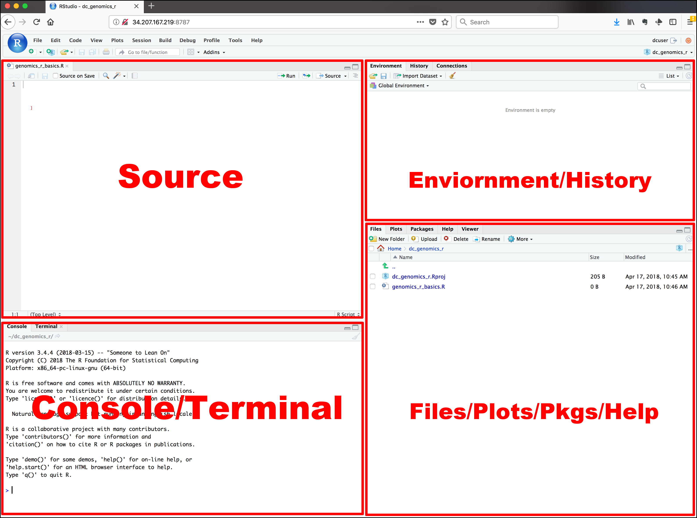
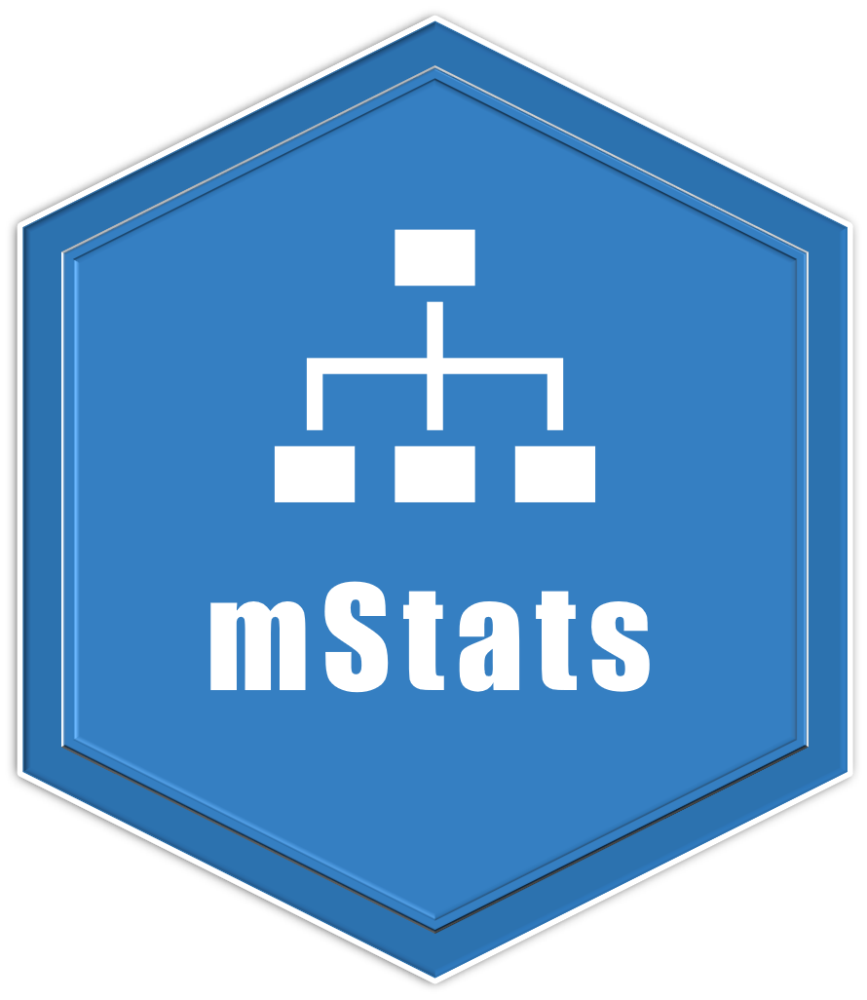

<style>
#TOC {
  top: 1%;
  opacity: 0.5;
}
#TOC:hover {
  opacity: 1;
}
</style>

```{r setup, include=FALSE}
knitr::opts_chunk$set(
  collapse = TRUE,
  comment = "#>",
  fig.path = "man/figures/README-",
  out.width = "100%"
)
options(tibble.print_min = 5, tibble.print_max = 5)

library(epuRate)
library(rmarkdown)
library(mStats)
```
 
 
# Introduction   

## R 

`R` is a **free** software for statistics and graphics. It is widely used among statisticians and data scientists for developing statistical software and data analysis. It is also increasingly popular among medical and public health researchers and analysts. `R` is primarily developed in three programming languages: C, Fortran, and R itself. Although It can be used by its default command-line interface, there are several third-party integrated development environments (IDE) with a friendly graphical user interface, including RStudio and Jupyter Notebook.    

`R` comes from `S programming language`. `S` was created by [John Chambers](https://en.wikipedia.org/wiki/John_Chambers_(programmer)) in 1976 at Bell Labs. Later two statisticians, Ross Ihaka and Robert Gentleman developed R that is currently developed by the R Development Core Team. `R` is named partly after them and partly as a play on the name of `S`.    


R has a steep learning curve, especially for people working in the health sector, including medical doctors and public health professionals. They just want to get on with data analysis, rather than spending months or even years to master the basics of programming aspects of R. Although these may be the core advantages of R that may come into use later, it seems a very daunting process to them. With that in mind, the `mStats` package is developed to speed up the process of learning data analysis in R without the need of detailed knowledge of the basics of R. There are several such well-known packages for epidemiological calculations such as `epicalc`, `epiR`, `epitools` and `epistats`. There are advantages of using the `mStats`. First, all functions are developed from the user perspectives to be easy to recall their names. Second, they only perform a task with fewer options than a conventional function in R. This simplifies the thinking and implementation process. Third, the first input into the function is `data`. This has two benefits. It saves the nuisance of writing subsetting commands and these functions can handle the pipe operation using the function, `%>%` of the package `magrittr`.

R can be downloaded from [http://cran.r-project.org/](http://cran.r-project.org/). 


## RStudio  

`RStudio` is an integrated development environment for R. It meansIt comes in two versions: Desktop version is a desktop application and server version runs on a web browser. Regular `RStudio` for personal usage is free for both desktop and server version.    

> If R is a car engine, then RStudio is every other thing that makes driving car fun.

`RStudio` can be downloaded from [https://rstudio.com/products/rstudio/download](https://rstudio.com/products/rstudio/download). 

### RStudio's Interface

The interface has four windows. Each window may have several tabs or sub-windows. By default, Source is on the top-left corner, console on bottom-left, environment on top-right, and files on bottom-right. 

* `Source` is a text editor that will be referred to as R Script later on. You can write commands and save them, which is the main point of reproducibility. Anyone who has this R Script can review and edit it in the future. 
* `Console` is the place you write your line-by-line command. It means you can only write a single command or a long paragraph of commands. After you close the RStudio, the commands will not be saved unless you specified to do so. However, it is the best way to saving R Script to store the commands you desire. 
    -	Symbol “>” called prompt
    -	Type `3 + 4`, and press `Enter`. 
* `Environment` has several sub-windows. For data management and beginner, you only have to know `Environment` and `History`. 
    - `Environment` is where R works. 
    - `Global Environment` is the place where your data will be after importing data.
    - `History` saves the commands you run in R console.
    - `Connections` is where you connect to external databases.
* `Files` also has several sub-windows. 
    - `Files` is like a folder manager on your phone. You can manage files and folders as well as set the working directory.
    - `Plots` is where your plots will appear.
    - `Packages` is where you manage your R packages. You can install it from CRAN or other repositories. You can also install locally stored R packages.
    - `Help` is where R stores documentations. You can open the help or introduction page of the respective packages as well as individual functions. 
    

 
## mStats <a href='https://myominnoo.github.io'></a>

<!-- badges: start -->

[](https://cran.r-project.org/package=mStats)
[](https://cran.r-project.org/package=mStats)

<!-- badges: end -->

 
